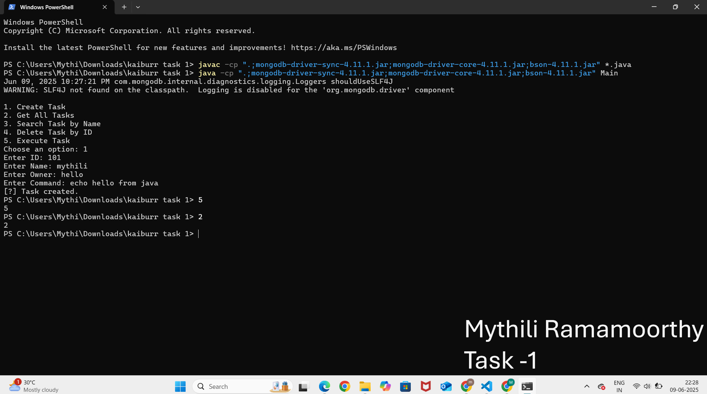

# Kaiburr Task 1 - Java Application with MongoDB

This project implements a basic Java-based Task Manager using **MongoDB** as the backend database. It allows you to create, validate, and manage tasks using simple Java classes and the MongoDB Java driver.

---

##  Features

- Add, validate, and manage tasks.
- Connects to MongoDB using MongoDB Java Driver.
- Performs operations using Java classes and OOP concepts.

---

## Project Structure

kaiburrtask1/
├── .github/ # (Optional) GitHub workflows or documentation
├── bson-4.11.1.jar # BSON dependency
├── mongodb-driver-core-4.11.1.jar # Core MongoDB driver
├── mongodb-driver-sync-4.11.1.jar # MongoDB synchronous driver
├── Database.java # Manages MongoDB connection
├── Task.java # Task POJO
├── TaskExecution.java # Main execution logic
├── Validation.java # Business validation logic
├── Main.java # Entry point

yaml
Copy
Edit

---

##  Technologies Used

- Java 8 or above
- MongoDB
- MongoDB Java Driver (`.jar` files)

---

##  Setup & Run

### Prerequisites

- JDK installed
- MongoDB running locally or remotely
- All `.jar` dependencies (drivers) in the same directory

### Compile

```bash
javac -cp ".;mongodb-driver-sync-4.11.1.jar;mongodb-driver-core-4.11.1.jar;bson-4.11.1.jar" *.java
Run
bash
Copy
Edit
java -cp ".;mongodb-driver-sync-4.11.1.jar;mongodb-driver-core-4.11.1.jar;bson-4.11.1.jar" Main
 On Linux/Mac use : instead of ; in the classpath.

Screenshots
You can upload screenshots (e.g., MongoDB output, terminal output, VS Code UI) and embed them like this:

markdown
Copy
Edit

